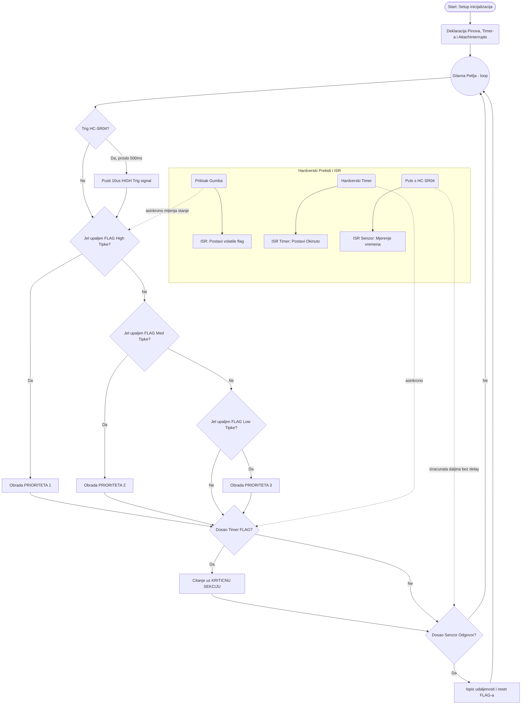

# Lab1: Prekidi u ugradbenim sustavima

## Autor
Hrvoje Sokcic (GitHub: [hrco69](https://github.com/hrco69/RUS--Sokcic))

## Opis rjesenja
Ovaj zadatak rjesava problematiku upravljanja visestrukim prekidima i njihovim prioritetima na mikrokontroleru **ESP32**, uz uporabu Wokwi simulatora i PlatformIO radnog okvira.

U implementaciji su koristena:
1. **Tri tipkala (High, Med, Low):** Vanjski prekidi (External Interrupts) okidani na padajuci brid signala (`FALLING`), povezani na pinove 25, 26 i 27 koristeci interne pull-up otpornike. Postavljena je zastavica u ISR rutini, dok se softverski prioriteti reguliraju u glavnoj petlji, tako da *High* gumb uvijek ima pravo prvog prolaska kroz obradu ako dode do sukoba.
2. **Hardverski Timer:** Ugradeni ESP32 prescaler timer koji okida svake dvije sekunde (`2 000 000` mikrosekundi).
3. **HC-SR04 Senzor udaljenosti:** Implementiran ne-blokirajuci nacin citanja koji se oslanja iskljucivo na `CHANGE` vrste ISR prekida (hvatanje oba brida). 
4. **Upravljanje resursima (Kriticne sekcije):** Buduci da timer i senzor dijele vrijeme procesora, citanje njihovih zapisanih *isr* varijabli unutar `loop()`-a zasticeno je FreeRTOS semaforskim funkcijama `portENTER_CRITICAL()` i `portEXIT_CRITICAL()`.

---

## Control Flow Graph (Tijek programa)

Tijek glavnog programa (`loop`) i asinkroni prekidi (`ISR`) prikazani su koristeci Mermaid.js dijagram:

---

## Automatizirana Dokumentacija
Sva dokumentacija koda kreirana je koristeci **Doxygen** norme unutar izvornog koda te je automatizirana putem funkcije GitHub Actions.

